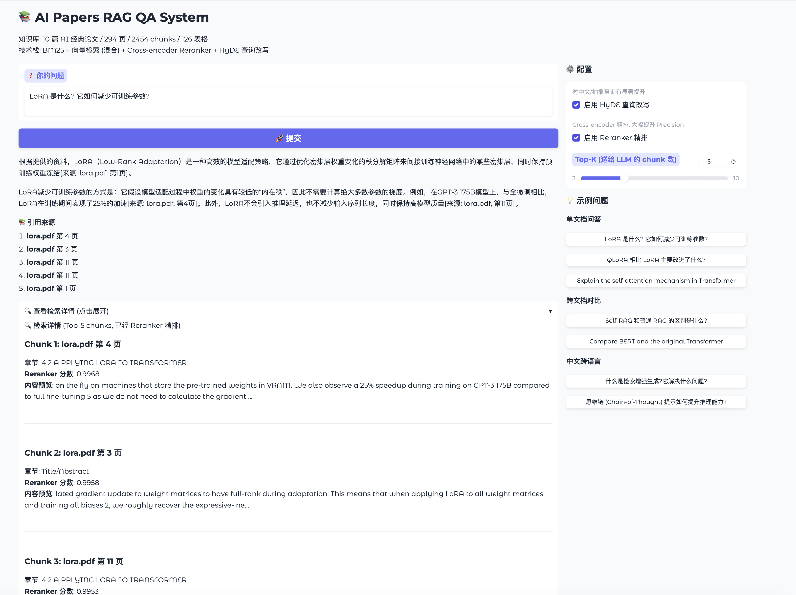
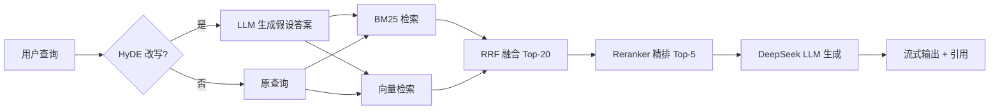

# 📚 AI Papers RAG QA System

> 一个端到端的 RAG 智能问答系统，知识库为 10 篇 AI 经典论文。
> 通过混合检索 + Reranker + HyDE 三件套，Faithfulness 达到 **93.37%**。



---

## ✨ 项目亮点

- 🎯 **量化评估驱动**：用 Ragas 框架跑出 4 个核心指标 + A/B 对比实验
- 🔍 **两阶段检索架构**：BM25 + 向量混合召回 + Cross-encoder 精排
- 💡 **HyDE 查询改写**：解决跨语言 / 抽象查询的召回失败
- 🎨 **Gradio Web UI**：流式输出 + 配置切换 + 检索详情可视化
- 🤖 **LoRA 微调**：用 Colab T4 微调 Qwen2.5-1.5B 做指令遵循
- 📊 **8 个 git tag 标记迭代轨迹**：v0.1 (Day 1) → v0.6 (Day 6)

---

## 🏗️ 系统架构



**核心模块**：

| 模块 | 技术 |
|---|---|
| PDF 解析 | PyPDF（正文） + pdfplumber.extract_tables()（表格） |
| 文本切片 | RecursiveCharacterTextSplitter (chunk=500, overlap=50) |
| Embedding | BAAI/bge-small-zh-v1.5（中英双语） |
| 向量库 | ChromaDB（持久化 2454 chunks） |
| 关键词检索 | BM25Okapi（pickle 持久化） |
| 检索融合 | RRF (Reciprocal Rank Fusion), 权重 30/70 |
| Reranker | BAAI/bge-reranker-v2-m3 (Cross-encoder) |
| 查询改写 | HyDE (Hypothetical Document Embeddings) |
| LLM | DeepSeek-Chat (OpenAI 兼容 API) |
| 评估框架 | Ragas (LLM-as-Judge) |
| Web UI | Gradio Blocks (流式输出) |

---

## 📊 评估结果

### Ragas 4 指标 (v3+HyDE 配置, 15 个测试问题)

| 指标 | 分数 | 业界基准 |
|---|---|---|
| **Faithfulness** (反幻觉) | **93.37%** | >85% 优秀 |
| **Context Recall** (召回完整性) | **73.33%** | >70% 良好 |
| **Answer Relevancy** (答案聚焦度) | **70.40%** | - |
| **Context Precision** (检索准确度) | **55.74%** | - |

### A/B 对比 (v1 baseline → v3 → v3+HyDE)

| 指标 | v1 baseline | v3 (Hybrid+Rerank) | v3 full (+HyDE) | 总提升 |
|---|---|---|---|---|
| Faithfulness | 74.79% | 86.94% | **93.37%** | **+18.58pp** |
| Context Precision | 29.67% | 47.20% | **55.74%** | **+26.07pp** |
| Context Recall | 60.56% | 64.44% | **73.33%** | +12.77pp |
| Answer Relevancy | 53.51% | 48.57% | **70.40%** | +16.89pp |

### 诚实性测试 (5 个 out-of-scope 问题)

- **Refusal Rate: 100%** (5/5 正确拒答, 且能精确说明知识库内容)

---

## 🚀 快速开始

### 环境准备

```bash
# Conda 环境
conda create -n rag python=3.11
conda activate rag

# 安装依赖
pip install -r requirements.txt

# 配置 API Key
cp .env.example .env
# 编辑 .env, 填入 DEEPSEEK_API_KEY
```

### 准备数据

```bash
# 把 10 篇 PDF 放到 data/raw_pdfs/
# (可选: 用项目里 notebooks/ 下的脚本下载)
```

### 启动 Web UI

```bash
python app.py
# 浏览器打开 http://localhost:7860
```

### 跑评估

```bash
python src/evaluator.py
# 输出 evaluation/results/metrics_*.json
```

---

## 📁 项目结构

```
rag-qa-system/
├── app.py                          # Gradio Web UI
├── src/
│   ├── loader.py                   # PDF 加载 (PyPDF + pdfplumber)
│   ├── splitter.py                 # 文本切片
│   ├── section_detector.py         # 章节元数据增强
│   ├── retriever.py                # 混合检索 (BM25 + 向量)
│   ├── bm25_retriever.py           # BM25 索引
│   ├── reranker.py                 # bge-reranker-v2-m3
│   ├── hyde.py                     # HyDE 查询改写
│   ├── generator.py                # LLM 调用 (含流式)
│   ├── pipeline.py                 # 端到端 RAG Pipeline
│   ├── evaluator.py                # Ragas 评估
│   ├── eval_loader.py              # 评估数据加载
│   └── inference_lora.py           # LoRA 本地推理
├── evaluation/
│   ├── eval_dataset.json           # 20 题评估数据集
│   ├── run_comparison.py           # A/B 对比实验
│   ├── run_honesty_test.py         # 诚实性测试
│   └── results/                    # 评估结果 JSON
├── models/
│   └── qwen2.5-1.5b-lora-final/    # 微调后的 LoRA adapter
├── notebooks/
│   ├── compare_retrievers.py       # 检索器对比
│   ├── diagnose_*.py               # 诊断脚本 (LoRA回归/attention/hyde)
│   └── ...
├── data/raw_pdfs/                  # 10 篇 AI 论文 (gitignored)
├── chroma_db/                      # 向量库 (gitignored)
└── docs/                           # 截图等
```

---

## 🔬 工程演进 (8 个 Git Tag)

| Tag | 日期 | 主题 | 关键产出 |
|---|---|---|---|
| **v0.1** | Day 1 | 端到端 RAG 跑通 | 纯向量检索 + DeepSeek API |
| **v0.2** | Day 2 | PDF 升级 + 章节元数据 | pdfplumber 表格提取, 语义切片 A/B 实验 |
| **v0.2.1** | Day 2 | 章节识别 v2 | 4 层过滤规则解决误识别 |
| **v0.3** | Day 3 | 混合检索 + Reranker | 修复 Day 2 的 Q1 回归 bug |
| **v0.4-step1** | Day 4 | HyDE 查询改写 | 修复 Q4 召回失败 |
| **v0.4** | Day 4 | Ragas 评估 + A/B 对比 | 完整评估 pipeline |
| **v0.5** | Day 5 | LoRA 微调 Qwen2.5-1.5B | Colab T4, 11min, loss 2.27→1.4 |
| **v0.6** | Day 6 | Gradio Web UI + 流式输出 | 配置切换, 检索详情可视化 |

每个 tag 对应一个完整的工程问题被解决，详见 [Releases](https://github.com/leonzhanglikang-png/rag-qa-system/releases) 页面。

---

## 💡 关键工程决策

### 1. 为什么 BM25 权重 0.3，向量权重 0.7?

A/B 实验对比 50/50 vs 30/70，发现 50/50 时 BM25 在中文查询上的噪声会污染结果（chain_of_thought.pdf 第 42 页被错误推到 top-1）。30/70 让向量主导，更适合**中英混合的查询语言分布**。生产环境如果有用户日志，应该按真实分布做权重调优。

### 2. 为什么 Reranker 用 cross-encoder 而不是 bi-encoder?

Bi-encoder（向量检索用的）独立编码 query 和 doc，速度快但精度有限。Cross-encoder 把 query+doc 拼接后一起送进 Transformer，捕捉所有 token 间的精确交互，精度高但速度慢 5-10 倍。
**架构上**：bi-encoder 做粗召回（百万级候选），cross-encoder 做精排（几十个候选）——这是工业级搜索系统的标配。

### 3. HyDE 在什么场景下贡献最大?

在跨语言/抽象短查询上。诊断脚本验证：
- 原查询 `"Explain self-attention mechanism"` 下，attention.pdf 第 3-4 页（核心公式所在）完全没进 top-30
- HyDE 改写后，第 4 页排名第 1，第 3 页排第 9 和 16

A/B 实验也证实：Context Recall 上 HyDE 单项贡献 +9pp，是混合检索+Reranker 的 2.3 倍。**因为前者解决排序问题，后者解决召回问题**。

### 4. 已知限制（诚实标注）

- **数学公式召回弱**：bge-small-zh 对碎片化数学公式（如 `softmax(QK^T/√d)V`）表征弱，是 embedding-based retrieval 的根本性限制。生产改进方向：换 MathBERT 或对公式做结构化索引。
- **fixed top_k=5 引入噪声**：导致 Context Precision 偏低（55%）。生产改进方向：adaptive retrieval，按 score threshold 动态决定召回数量。
- **微调小模型不集成进 RAG generator**：1.5B 跟 DeepSeek 比质量差距明显。微调模块独立存在，证明的是"我能完整跑通 LoRA 训练 + 部署"这项能力。

---

## 🛠️ 技术栈

**核心库**: LangChain · ChromaDB · transformers · peft · FlagEmbedding · Ragas · Gradio · DeepSeek API

**训练**: Google Colab T4 GPU · Qwen2.5-1.5B-Instruct · alpaca-zh

**部署**: Mac M4 (推理) · MPS / CPU fallback

---

## 📝 License

MIT